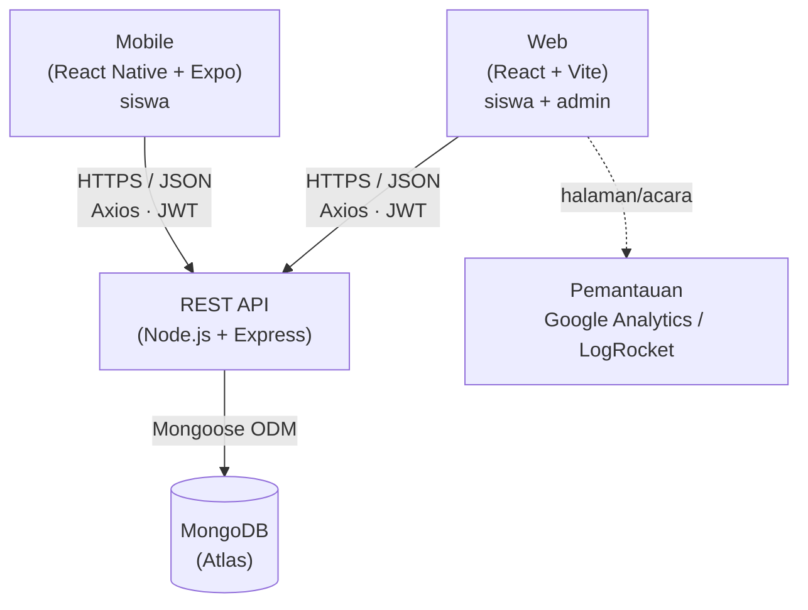
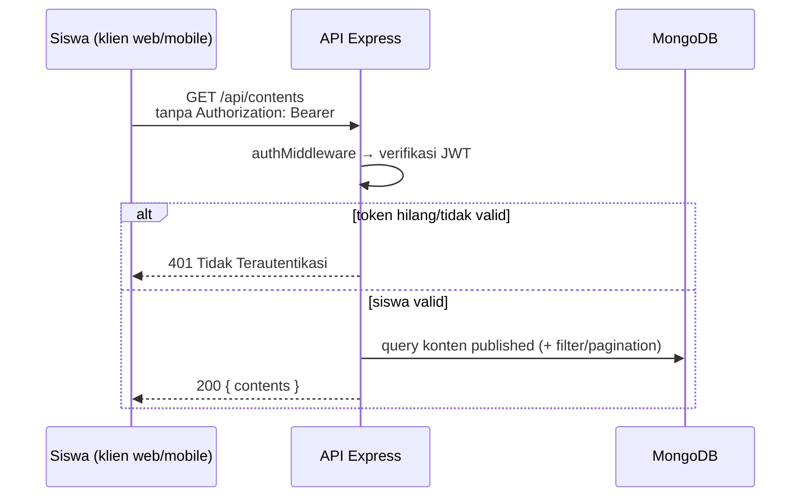
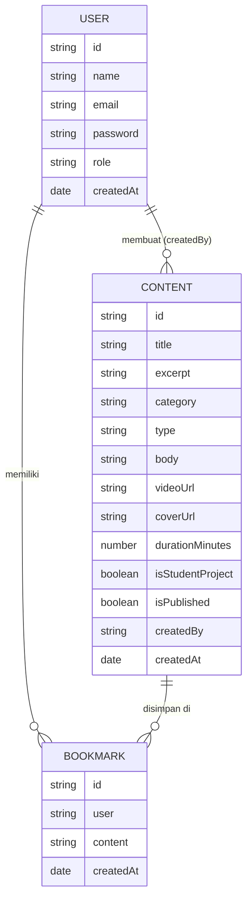
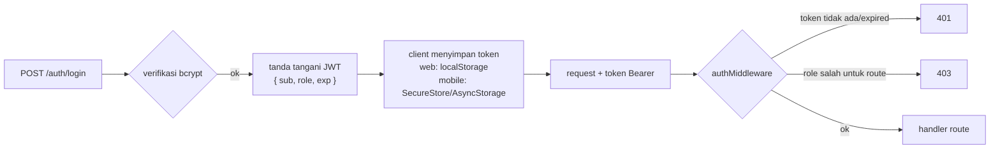
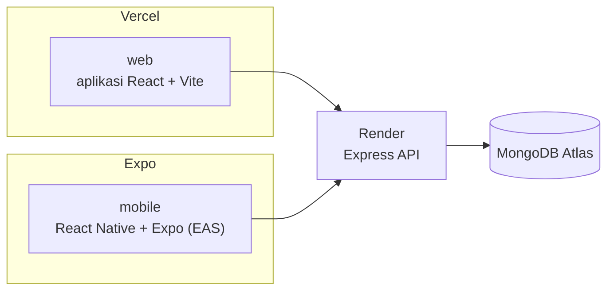

# Dokumen Persyaratan Teknis (TRD)
### My Skill — Platform Pembelajaran Praktik untuk Siswa SMK Teknik

| | |
|---|---|
| **Mata Kuliah** | Pengembangan Platform Khusus |
| **Luaran** | Proyek Akhir — Aplikasi My Skill (web + mobile + API) |
| **Dokumen** | Persyaratan Teknis (platform pembelajaran praktik) |
| **Dokumen Pendamping** | `product-requirements.md` |
| **Status** | Draf untuk ditinjau |
| **Tanggal** | 2026-08-13 |

---

## 1. Introduction

Dokumen ini berisi rancangan teknis My Skill, lanjutan dari `product-requirements.md`. Di sini dijelaskan system architecture, API, data model, authentication, aplikasi web dan mobile, monitoring, dan langkah menjalankan di lokal.

Sistemnya terdiri dari dua clients dan satu backend:

1. Web app (React + Vite) — semua alur student + halaman content management admin.
2. Mobile app (React Native + Expo) — semua alur student.
3. Satu API Node.js/Express dengan database MongoDB.

Web dan mobile memakai REST contract yang sama. Aturan bisnis, terutama gated content (BR-1), diterapkan di API supaya tidak ada client yang bisa menghindarinya.

---

## 2. System Architecture



**Prinsip desain**

- **Satu API, banyak clients.** Aturan bisnis (gated content, bookmark ownership, admin authorization) ditaruh di API supaya web dan mobile ikut terbatasi dan tidak bisa melewatinya.
- **Stateless auth.** API tidak menyimpan server session; tiap request membawa JWT. Pola ini mudah diskalakan dan cocok untuk web maupun mobile.
- **Thin clients.** Client hanya render, validasi untuk UX, dan memanggil API. Authorization tidak pernah dipercaya dari client.

### 2.1 Request flow (contoh: akses konten yang dibatasi)



---

## 3. Tech Stack

| Lapisan | Teknologi | Catatan |
|-------|------------|-------|
| Web | **React 19 + React Router**, dibangun dengan **Vite** | Responsif melalui Flexbox / CSS Grid |
| Mobile | **React Native + Expo** (React Navigation) | Stack + bottom tabs |
| Klien HTTP | **Axios** (Fetch dapat digunakan) | Pola request/interceptor bersama |
| Backend | **Node.js + Express.js** | REST API |
| Database | **MongoDB** (Atlas) + **Mongoose** | Schema & validasi |
| Authentication | **JWT** (`jsonwebtoken`) + **bcrypt** | Identitas user + role |
| Validasi | **express-validator** (atau `zod`) | Validasi input di sisi server |
| Deployment — Web | Vercel (atau Netlify) | Satu proyek web |
| Deployment — API | Render (atau Heroku) | Satu service |
| Deployment — Mobile | Expo (EAS) | Build Android/iOS |
| Monitoring | **Google Analytics** atau **LogRocket** | Pada web client |

Stack mengikuti ketentuan tugas: React JS, React Native, Node.js/Express, dan MongoDB. Kalau ada beberapa pilihan (misalnya Vercel atau Netlify), pilih satu dan pakai konsisten.

---

## 4. Repository Structure

Monorepo dipakai supaya API dan kedua klien mudah ditemukan, mengikuti pola proyek marketplace sebelumnya.

```
my-skill/
├── api/                     # Node.js + Express + Mongoose  (di-deploy ke Render)
│   ├── src/
│   │   ├── models/          # User, Content, Bookmark
│   │   ├── routes/          # auth, contents, bookmarks
│   │   ├── controllers/
│   │   ├── middleware/      # autentikasi (JWT), otorisasi admin, error handler
│   │   └── app.js
│   ├── tests/               # Jest
│   └── package.json
├── web/                     # Aplikasi React + Vite (student + admin)
├── mobile/                  # Aplikasi React Native + Expo (student)
├── docs/                    # PRD + TRD ini
├── .github/workflows/       # CI checks
└── package.json             # Perintah root: dev, test, build
```

---

## 5. Data Model

Ada tiga collections: `users`, `contents`, dan `bookmarks`. Bookmark adalah many-to-many relation antara user dan konten.



### 5.1 Collection schema (gaya Mongoose)

**users**
```js
{
  name:     { type: String, required: true },
  email:    { type: String, required: true, unique: true, lowercase: true },
  password: { type: String, required: true }, // hash bcrypt
  role:     { type: String, enum: ['siswa', 'admin'], default: 'siswa' }
}
```

**contents**
```js
{
  title:        { type: String, required: true, trim: true },
  excerpt:      { type: String, required: true },
  category:     { type: String, required: true, index: true,
                  enum: ['Otomotif', 'Elektronika', 'Kelistrikan',
                         'Bangunan', 'Pemesinan & Pengelasan'] },
  type:         { type: String, required: true, index: true,
                  enum: ['artikel', 'video'] },
  body:         { type: String },  // wajib jika type = 'artikel' (BR-5)
  videoUrl:     { type: String },  // wajib jika type = 'video' (BR-5)
  coverUrl:     { type: String, required: true }, // URL HTTP(S), bukan file upload
  durationMinutes: { type: Number, min: 1 },
  isStudentProject: { type: Boolean, default: false }, // badge "Hasil Praktek Siswa"
  isPublished:  { type: Boolean, default: true, index: true },
  createdBy:    { type: ObjectId, ref: 'User', required: true },
  createdAt:    { type: Date, default: Date.now }
}
```

**bookmarks** — satu per (user, konten)
```js
{
  user:    { type: ObjectId, ref: 'User', required: true },
  content: { type: ObjectId, ref: 'Content', required: true },
  createdAt: { type: Date, default: Date.now }
}
// unique compound index { user: 1, content: 1 } supaya bookmark tidak duplikat (BR-4)
```

Kenapa pembatasan konten ditaruh di level API? Konten adalah satu-satunya "barang dagangan" My Skill. Kalau pembatasannya ada di middleware API, bukan di UI, web dan mobile otomatis ikut terbatasi tanpa menulis ulang logika (BR-1).

---

## 6. REST API Specification

Base URL: `/api`. Semua request/response body adalah JSON. Protected routes memerlukan `Authorization: Bearer <token>`.

**Legenda:** 🔓 public · 🧑 token user terdaftar (student/admin) · ⚙️ token admin

### 6.1 Authentication

| Metode | Path | Akses | Tujuan |
|--------|------|:------:|---------|
| POST | `/api/auth/register` | 🔓 | Register akun student `{ name, email, password }` |
| POST | `/api/auth/login` | 🔓 | Login → JWT `{ sub, role }` |
| GET | `/api/auth/me` | 🧑 | Ambil identitas user dari token |

### 6.2 Content — **gated (wajib login)**

| Metode | Path | Akses | Tujuan |
|--------|------|:------:|---------|
| GET | `/api/contents` | 🧑 | List konten published (query: `?search=&category=&type=&page=`) |
| GET | `/api/contents/:id` | 🧑 | Detail konten (`404` jika tidak published) |
| POST | `/api/contents` | ⚙️ | Admin membuat konten |
| PUT | `/api/contents/:id` | ⚙️ | Admin update konten |
| DELETE | `/api/contents/:id` | ⚙️ | Admin unpublish konten (soft delete → `isPublished: false`) |

Semua content routes mengembalikan `401` kalau token user tidak ada atau tidak valid. Di sinilah aturan gated content (BR-1) ditegakkan; redirect UI ke login hanya kemudahan.

### 6.3 Bookmark — **khusus user sendiri**

| Metode | Path | Akses | Tujuan |
|--------|------|:------:|---------|
| GET | `/api/bookmarks` | 🧑 | List bookmark milik user (F6) |
| POST | `/api/bookmarks/:contentId` | 🧑 | Simpan konten (toggle; tidak duplikat — BR-4) |
| DELETE | `/api/bookmarks/:contentId` | 🧑 | Hapus bookmark milik user (BR-4) |

### 6.4 Response & error conventions

- **Sukses:** `2xx` dengan `{ success: true, message, data }`.
- **Validation error:** `400` dengan `{ error, details: [...] }`.
- **Authentication:** `401` (token tidak ada/tidak valid) vs `403` (token valid, role salah).
- **Not found:** `404`. **Server error:** `500` (jangan pernah membocorkan stack trace ke client).
- Respons bookmark menyertakan `saved` (boolean) supaya client mudah menampilkan status toggle.

---

## 7. Authentication & Authorization



- **JWT payload:** `{ sub: <userId>, role: 'siswa' | 'admin', iat, exp }`. Ditandatangani dengan `JWT_SECRET`; expiry (misalnya 7 hari) bisa diatur.
- **Password:** di-hash dengan **bcrypt**, tidak pernah disimpan atau dicatat dalam plain text.
- **Middleware:**
  - `requireAuth` — verifikasi token dan mengisi `req.user`.
  - `requireAdmin` — memastikan `req.user.role === 'admin'` untuk content management routes (BR-7).
- **Protected routes (Soal 4):** semua content & bookmark routes (`requireAuth`), semua content write routes (`requireAdmin`).
- **Token storage di web:** `localStorage`. Di mobile: Expo **SecureStore** (utama) atau **AsyncStorage**; saat aplikasi dibuka, session dipulihkan dari token yang tersimpan.

---

## 8. Frontend Architecture

### 8.1 Web (React + Vite)

- **Routing (React Router):**
  - Public: `/login`, `/register`.
  - Protected: `/` (home), `/konten`, `/konten/:id`, `/bookmark`, `/profile`.
  - Admin: `/admin/konten`, `/admin/konten/baru`, `/admin/konten/:id/edit`.
  - Protected routes dibungkus `<ProtectedRoute>` yang mengecek token dan redirect ke login.
- **State:** ringan, pakai React Context untuk session dan bookmark; sisanya component state. Redux opsional, tidak wajib.
- **API layer:** Axios client memakai base URL dari env; request interceptor memasang Bearer token, response interceptor menangani `401` (auto logout + redirect ke login).
- **Responsive (Soal 1):** Flexbox/CSS Grid; grid konten jadi satu kolom di layar sempit; tidak ada fixed pixel layout.

### 8.2 Mobile (React Native + Expo)

- **Navigation:** React Navigation — bottom tabs (Home, Konten, Bookmark) + stack (Content Detail, Login, Register, Profile).
- **Screens:** Login, Register, Home, Content List, Content Detail, Bookmark, Profile.
- **API integration:** pakai REST path dan Axios pattern yang sama; base URL mengarah ke API yang di-deploy (Expo `extra.apiUrl`).
- **Token persistence:** SecureStore/AsyncStorage; session dipulihkan saat aplikasi dibuka.

### 8.3 Konvensi client bersama

- Base URL API dari environment (`VITE_API_URL`; di Expo `extra.apiUrl`) — jangan hard-code host yang di-deploy.
- Tiap data screen punya loading / empty / error state yang jelas.
- Validasi di client hanya untuk UX; API tetap source of truth.

---

## 9. Security & Validation

| Aspek | Persyaratan |
|---------|-------------|
| Password | Di-hash dengan bcrypt; minimum length (8 karakter) diterapkan saat register |
| Secrets | `JWT_SECRET`, DB URI, dll. dalam environment variable — tidak pernah di-commit |
| Input validation | Di server pada setiap write (express-validator/zod): tipe, required fields, `body`/`videoUrl` sesuai type konten (BR-5), nilai enum kategori/type/role |
| AuthZ | Role check di level route (`requireAdmin`) + ownership check bookmark (BR-4, BR-7) |
| Gated content | Diterapkan di server (`401`) secara independen dari UI (BR-1) |
| CORS | Batasi ke origin web/mobile yang dikonfigurasi lewat `CORS_ORIGINS` |
| Rate limiting | `express-rate-limit` dasar pada auth endpoints untuk meredam brute force |
| Transport | HTTPS di semua tempat (disediakan oleh Vercel/Render) |
| Error hygiene | Tidak ada stack trace atau secrets dalam error response ke client |

---

## 10. Deployment Architecture



| Artefak | Platform | Keluaran |
|----------|----------|--------|
| Web | Vercel (atau Netlify) | Public URL |
| API | Render (atau Heroku) | Public HTTPS base URL |
| Database | MongoDB Atlas | Connection URI (env) |
| Mobile | Expo (EAS) | Build Android/iOS (APK/IPA) |

- Setiap deployment target punya env var sendiri (API: `MONGODB_URI`, `JWT_SECRET`; web: `VITE_API_URL`, `VITE_GA_ID` opsional; mobile: `apiUrl`).
- Sebelum pilih hosting publik, pastikan local build API, web, dan mobile tetap jalan.

---

## 11. Monitoring & Analytics

- **Google Analytics** (GA4) dipasang sekali di **web client**.
- Minimal lacak: page/route views dan beberapa key events (misalnya `login`, `content_view`, `bookmark_add`).
- Measurement id disimpan di env var; dimatikan saat local development supaya tidak mencemari data.

---

## 12. Local Development Setup

**Prerequisites:** Node.js 22.22.0 atau lebih baru, npm/pnpm, serta MongoDB Atlas URI atau MongoDB lokal.

```bash
# 1. API
cd api
cp .env.example .env         # set MONGODB_URI, JWT_SECRET, PORT
npm install
npm run dev                  # http://localhost:4000

# 2. Web
cd ../web
cp .env.example .env         # set VITE_API_URL=http://localhost:4000/api
npm install
npm run dev                  # http://localhost:5173

# 3. Mobile (Expo) — membutuhkan API aktif di port 4000
cd ../mobile
npm install
npm run start                # Expo dev server / Expo Go

# Atau, dari root repositori setelah menginstal dependensi setiap aplikasi:
# npm install
# npm --prefix api install
# npm --prefix web install
# npm --prefix mobile install
# npm run dev                  # menjalankan API dan web bersamaan
```

### 12.1 Environment variables

| Aplikasi | Variabel | Contoh |
|-----|----------|---------|
| API | `MONGODB_URI` | `mongodb+srv://…` |
| API | `JWT_SECRET` | `<random-long-string>` |
| API | `PORT` | `4000` |
| API | `CORS_ORIGINS` | `http://localhost:5173,https://my-skill.vercel.app` |
| Web | `VITE_API_URL` | `http://localhost:4000/api` |
| Web | `VITE_GA_ID` / id LogRocket | `G-XXXX` |
| Mobile | `apiUrl` (Expo `extra`) | `https://api.example.com/api` |

---

## 13. Rubric Mapping (Soal 1–5)

| Soal (bobot) | Topik | Cakupan teknis |
|---------------|-------|--------------------|
| **Soal 1 (20%)** | Frontend Web React | §8.1 — React Router, `ProtectedRoute`, Flexbox/Grid responsif, register/login/home/list/detail |
| **Soal 2 (20%)** | Backend Node/Express + MongoDB | data model §5, REST API §6, validasi §9 — CRUD konten & user dengan input validation |
| **Soal 3 (20%)** | Mobile React Native | §8.2 — layar mobile inti (login, register, home, list, detail) memakai API yang sama |
| **Soal 4 (20%)** | Integrasi Data & Autentikasi | JWT auth §7, gated content & protected routes, role/ownership guard; Axios integration §8.3 |
| **Soal 5 (15%)** | Deployment & Pemantauan | Google Analytics §11 diimplementasikan; public deployment §10 (web, API, mobile) |

---

## 14. Open Technical Decisions

| # | Keputusan | Default yang dipilih |
|---|----------|---------------|
| D1 | Strategi pagination untuk content list | Query parameter `page`/`limit` sederhana |
| D2 | Peran content admin | Dipertahankan: akun `admin` khusus (mirror peran seller di marketplace) untuk memenuhi CRUD Soal 2 |
| D3 | State management di web | React Context (tanpa Redux) kecuali kompleksitas meningkat |
| D4 | Penanganan video | External URL (YouTube embed / direct mp4); tanpa upload service |
| D5 | Kategori konten | Fixed enum 5 kategori teknik; penambahan kategori = ubah enum + migrasi data |
| D6 | Unpublish konten | Soft delete (`isPublished: false`) alih-alih hard delete |
| D7 | Pencegahan bookmark duplikat | Unique compound index `{ user, content }` + toggle di API |

Keputusan di atas masih bisa berubah saat pembangunan; kalau berubah, cukup edit bagian ini, tidak perlu mengubah seluruh dokumen.
